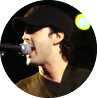

|

Jeffrey A. Clark (Alex)
===================================

|

|

About
-----

- Musician at |headstraight|
- Creator of |python_pillow|
- President of |aclark_net|
- President & Executive Director of |dc_python|

|

.. raw:: html

   <a href="https://twitter.com/intent/tweet?screen_name=aclark4life&ref_src=twsrc%5Etfw" class="twitter-mention-button" data-size="large" data-show-count="false">Tweet to @aclark4life</a>

Articles
--------

.. toctree::
   :maxdepth: 1

   now
   2017/06/26/saml-1-alex-clark-0
   2016/11/23/project-makefile
   2015/02/10/please-do-my-homework
   2014/10/02/pillow-runs-itself
   2013/02/23/trading-places-trading-scene-explained
   2012/01/30/new-vanity-release
   2011/02/16/cioppino-sprint-report
   2010/03/30/a-new-plone-book
   2009/12/31/new-years-python-meme
   2008/03/06/unix-tips-for-the-elderly
   2007/03/16/first-post
   widget.rst

|

.. Links

.. |headstraight| raw:: html

    <a href="https://headstraightband.com" target="_blank">Headstraight</a>

.. |aclark_net| raw:: html

    <a href="https://aclark.net" target="_blank">ACLARK.NET, LLC</a> 

.. |python_pillow| raw:: html

    <a href="https://python-pillow.org" target="_blank">Python Pillow</a>

.. |dc_python| raw:: html

    <a href="https://dcpython.org" target="_blank">DC Python</a>
